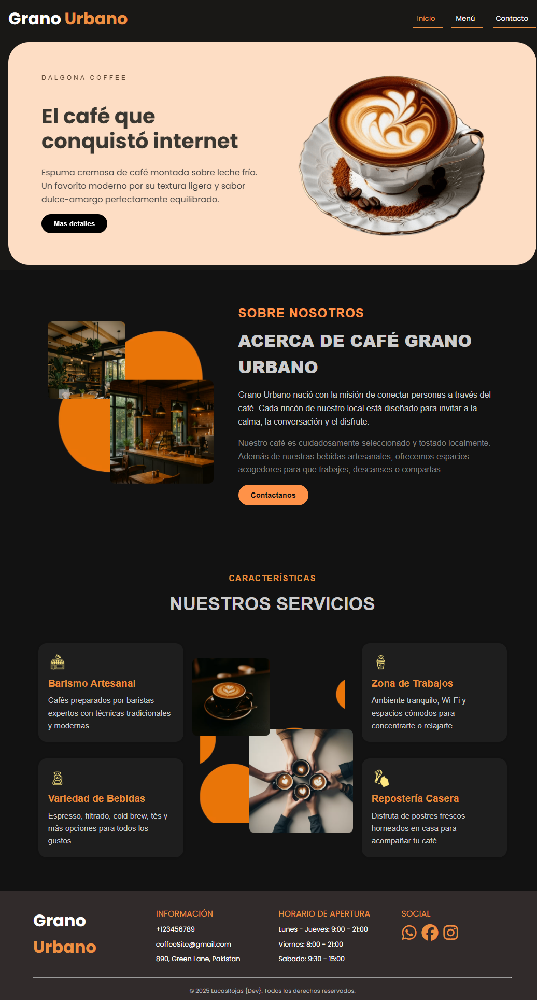

# ☕ Grano Urbano

Grano Urbano es una página web moderna y responsiva desarrollada para una cafetería local. El sitio presenta un diseño atractivo que destaca los servicios, productos y ambiente del café, ofreciendo una experiencia visual agradable y profesional.

## 🚀 Características

- Sección de bienvenida con producto destacado
- Información sobre la cafetería y su filosofía
- Servicios destacados como barismo, repostería y zonas de trabajo
- Diseño responsivo y moderno
- Animaciones suaves e imágenes atractivas
- Navegación clara e intuitiva

## 🛠️ Tecnologías

- HTML5
- CSS3
- JavaScript (modular)
- Webpack 
- Imágenes y assets optimizados

## 📷 Vista previa



## 📁 Estructura del proyecto

```
/src
  ├── assets/
  ├── modules/
  ├── styles/
  ├── index.js
  └── template.hmtl/
```

## 🧾 Meta

**Autor:** [Lucas Rojas](https://github.com/TuUsuario)  
**Licencia:** MIT

¡Gracias por visitar Grano Urbano! ☕✨
